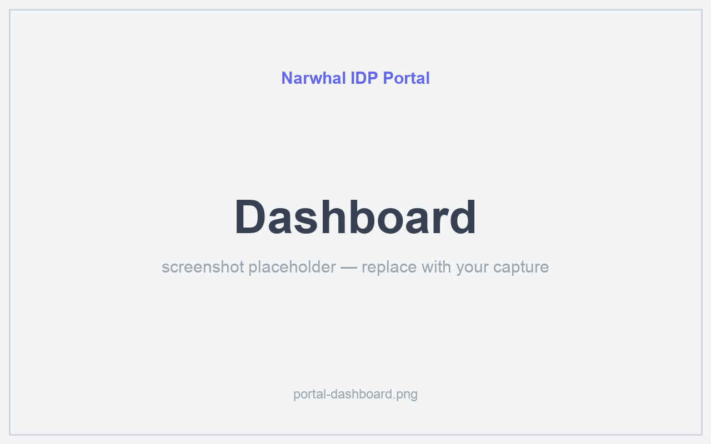
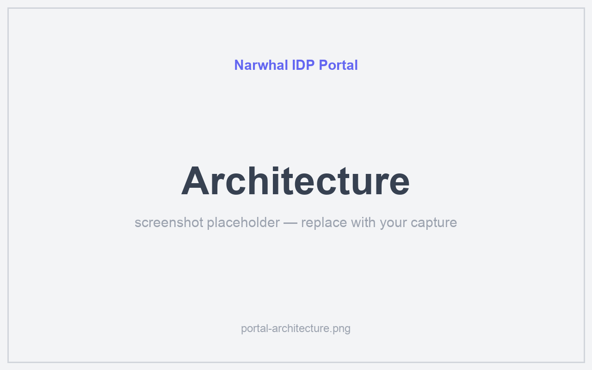
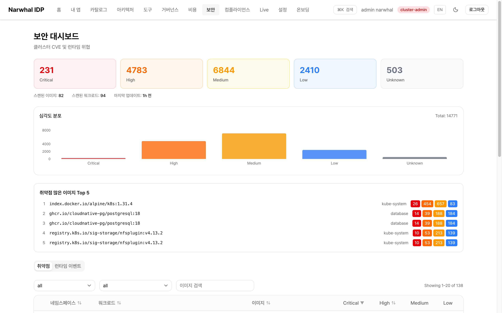
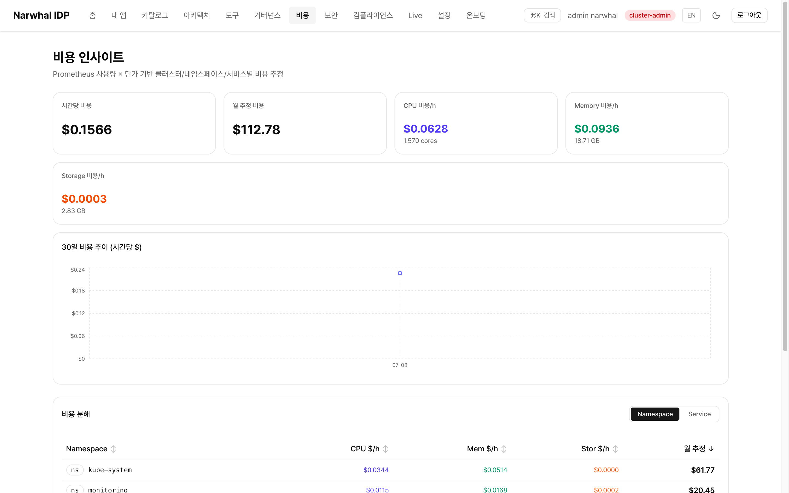
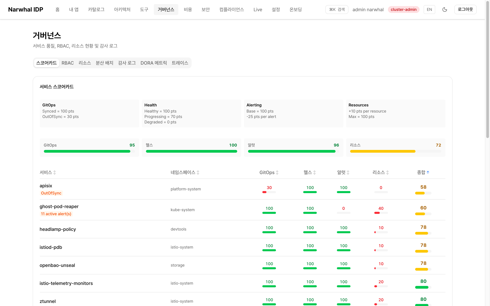
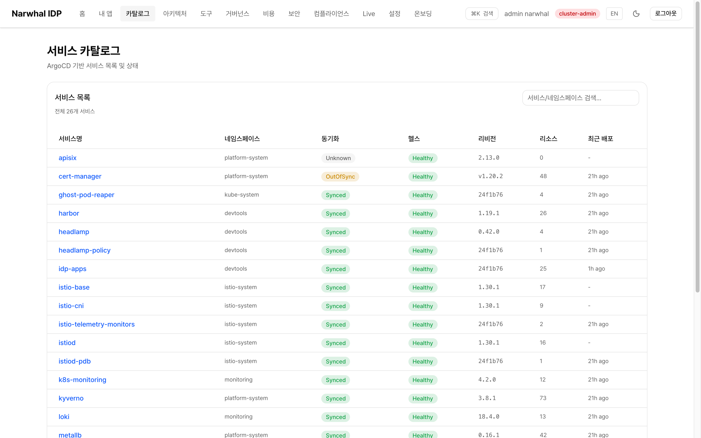

# Narwhal

[](https://github.com/dasomel/narwhal/releases/latest)
[](LICENSE)

English | [한국어](README_ko.md)

> **Narwhal** - A whale inhabiting the Arctic Ocean, characterized by a single long spiral tusk growing from its head. Called the "unicorn of the sea," it provides a powerful platform in a single cluster, just like this project.

**An open-source, reproducible Kubernetes Internal Developer Platform.**

Narwhal adds GitOps, IAM/SSO, service mesh, observability, registry, storage, backup, policy, an
API gateway and a management portal on top of Kubernetes, and delivers them as **one platform that
installs, verifies and operates as a single unit** — on a laptop, in a cloud, on-premises, or in a
fully air-gapped network.

> **Narwhal is not a Kubernetes installer.**
> Installing Kubernetes is the easy part. The hard part is making independently developed projects
> agree on DNS, certificates, identity, networking, startup order and version compatibility — and
> re-proving that agreement at every upgrade.
>
> **Narwhal provides that integration and operation, as open source.**

## Why Narwhal

Every component in the table below is excellent on its own. The cost is never a single component;
it is the seams between them:

- which `aud` claim the API server will accept from the identity provider
- which SSO cookie the service mesh silently corrupts
- which chart repository becomes unreachable the moment the network is cut
- which policy denies tomorrow a pod that ran fine today

Narwhal treats those seams as the product: they are scripted, verified in CI, and never thrown away.

### Integration knowledge as tests

Narwhal does not discard the failures it hits while integrating. Every one is written down —
**263 dated incidents** in [`lessons-log.md`](docs/common/lessons-log.md) — and each row records
more than a fix:

- what the cause actually was
- **how to tell it apart from the causes it resembles** (the discriminator)
- which tempting fixes do not work, and why

Those rows then become checks. The chain is deliberate:

```
Incident  →  Lesson  →  Discriminator  →  Regression test
```

Checks in the suite map back to specific dated incidents, so an integration bug that was solved
once cannot quietly return at the next Kubernetes or component upgrade. That loop — not the commit
count — is how this project is maintained.

### Project status

| | |
|---|---|
| Activity | 483 commits since 2026-02-08, 4 tagged releases (latest [v1.2.0](CHANGELOG.md)) |
| Verification | 51-check regression suite runs in CI on every push, plus cluster, SSO, backup and network-isolation test scripts |
| Integration knowledge | [263 documented incidents](docs/common/lessons-log.md), newest first, each with a discriminator |
| Deployment targets | Vagrant (ARM64) · Kakao Cloud (AMD64) · fully air-gapped |
| Offline install | 104 container images, 27 Helm charts, binaries, remote manifests and OS packages, bundled per architecture |
| Integrated components | 35 GitOps-managed applications |

Built on the [dasomel/ubuntu-26.04-xfs](https://app.vagrantup.com/dasomel/boxes/ubuntu-26.04-xfs)
box (XFS, project quota), produced by
[kube-ready-box](https://github.com/dasomel/kube-ready-box) — a Packer build with Ubuntu 26.04 and
the Kubernetes prerequisites pre-installed.

## Features

- **Kubernetes v1.35** - Supported upstream release branch, HA control plane (3 masters, tolerates 1 failure)
- **GitOps** - ArgoCD + Gitea (App-of-Apps pattern)
- **SSO** - Keycloak OIDC (via APISIX openid-connect plugin, App integration: ArgoCD, Grafana, Gitea, Harbor, Headlamp)
- **Observability** - Prometheus, Grafana, Loki, Tempo, Hubble
- **Storage** - NFS persistent storage, RWX via `nfs.csi.k8s.io` + SeaweedFS (Object/S3) + [nfs-quota-agent](https://github.com/dasomel/nfs-quota-agent)
- **Backup** - Velero + CNPG barman
- **Service Mesh** - Istio ambient mode (mTLS, zero sidecars, ztunnel)
- **Security** - cert-manager (TLS), OpenBao (Secrets), Kyverno (Policy)
- **Networking** - Cilium (CNI), APISIX (API Gateway, OIDC), MetalLB (LoadBalancer), kube-vip (VIP HA)

## Requirements

- [Vagrant](https://developer.hashicorp.com/vagrant/install) 2.4+
- [VirtualBox](https://www.virtualbox.org/wiki/Downloads) 7.1+ or [VMware Fusion](https://www.vmware.com/products/fusion.html) (development is done on Fusion; no minimum version has been established)
- 32GB+ RAM (40GB+ recommended)
- 30GB+ Disk per VM (recommended for full IDP deployment)

### VirtualBox Disk Expansion

To automatically expand disk size in VirtualBox, install the `vagrant-disksize` plugin:

```bash
vagrant plugin install vagrant-disksize
```

> **Note**: VMware Fusion is automatically handled via `vmx` settings.
> A 1TB thin-provisioned template is used.

## Quick Start

```bash
# Clone
git clone https://github.com/dasomel/narwhal.git
cd narwhal

# Create cluster
vagrant up --provider=vmware_desktop

# Check status
vagrant ssh master-1 -c "kubectl get nodes"

# Destroy
vagrant destroy -f
```

## Architecture

```
┌──────────────────────────────────────────────────┐
│                    Vagrant VMs                   │
├──────────────────┬─────────────┬─────────────────┤
│  master-1        │  master-2/3 │ worker-1/2/3    │
│  192.168.56.10   │  .11 / .12  │ .21 / .22 / .23 │
│  2 CPU, 6GB      │  2 CPU, 6GB │ 2 CPU, 6GB      │
│  NFS, dnsmasq    │  dnsmasq    │                 │
└──────────────────┴─────────────┴─────────────────┘
         │                │            │
         └────────────────┼────────────┤
                           │            │
            ┌──────────────┴────────────┴────┐
            │  VIP: 192.168.56.100           │
            │       (kube-vip API HA)        │
            │  LB:  192.168.56.200           │
            │       (MetalLB/APISIX)         │
            │  DNS: 192.168.56.10:53         │
            │  (*.local.narwhal.internal)    │
            └────────────────────────────────┘
```

## Components

Minor versions only — **[VERSIONS.md](VERSIONS.md) is the authority** for exact chart and image
versions, pinned digests, upstream state and known compatibility issues. Keeping the precise
numbers in one file is deliberate: duplicated version strings rot at different rates, and the copy
a reader trusts is whichever they hit first.

### Base Infrastructure (Script-installed)

| Component | Version | Description |
|-----------|---------|-------------|
| Kubernetes | v1.35.x | Container orchestration |
| Cilium | v1.19.x | CNI + kube-proxy replacement |
| Hubble | v1.19.x | Network observability |
| kube-vip | v1.1.x | Control plane VIP HA |
| MetalLB | v0.16.x | Bare-metal LoadBalancer |
| APISIX | 3.15.x | API Gateway (TLS + OIDC via openid-connect plugin) |
| cert-manager | v1.20.x | TLS automation |
| CloudNative-PG | v1.29.x | PostgreSQL Operator |
| Keycloak | 26.5.x | IAM / SSO (Operator) |
| Gitea | v1.26.x | Git server |
| ArgoCD | v3.4.x | GitOps CD |
| Istio | v1.30.x | Service mesh (ambient mode) |

### IDP Apps (ArgoCD GitOps)

| Component | Version | Description |
|-----------|---------|-------------|
| Prometheus Stack | v0.91.x | Monitoring (Prometheus + Grafana + Alertmanager) |
| Loki | 3.7.x | Log aggregation |
| Grafana Alloy | v1.17.x | Log collector (replaces Promtail; Promtail reached EOL 2026-03-02) |
| Tempo | 2.9.x | Distributed tracing |
| Harbor | v2.15.x | Container registry. Upstream source rebuilt for ARM64 as `ghcr.io/dasomel/goharbor` — a rebuild, not a fork; no source changes |
| OpenBao | v2.5.x | Secret management |
| Kyverno | v1.18.x | Policy engine |
| Headlamp | v0.42.x | Kubernetes UI |
| APISIX | 3.15.x | API Gateway (TLS + OIDC) |
| SeaweedFS | v4.34.x | Object storage (S3) |
| Velero | v1.18.x | Backup & Restore |

## Management Portal

The cluster ships with the **[Narwhal IDP Portal](https://github.com/dasomel/narwhal-portal)** (Next.js 16 + React 19) for day-2 operations — real-time metrics, GitOps status, security, cost, and self-service. Reachable at `https://portal.local.narwhal.internal` after install.

| Dashboard | Architecture |
| :---: | :---: |
|  |  |
| _Real-time metrics, ArgoCD apps & alerts_ | _Nodes, namespaces & service graph_ |
| **Security** | **Cost** |
|  |  |
| _Trivy vulnerability reports_ | _Namespace cost breakdown_ |
| **Governance** | **Catalog** |
|  |  |
| _Scorecard, DORA & distribution_ | _Self-service app catalog_ |

> Drop captures into [`docs/images/`](docs/images/) ([details](docs/images/README.md)). Full UI gallery: [narwhal-portal](https://github.com/dasomel/narwhal-portal).

## Access Services

### DNS Access (Recommended)

Access services via HTTPS domains using APISIX API Gateway and cert-manager self-signed TLS.

DNS Configuration: Configure the client's DNS to `192.168.56.10` or add entries to `/etc/hosts`.

| Service | URL | Credentials |
|--------|-----|-----------|
| ArgoCD | https://argocd.local.narwhal.internal | admin / (auto-generated secret) or Keycloak SSO |
| Grafana | https://grafana.local.narwhal.internal | Keycloak SSO (or the generated local admin) |
| Gitea | https://gitea.local.narwhal.internal | gitea-admin / see show-credentials.sh or Keycloak SSO |
| Harbor | https://harbor.local.narwhal.internal | admin / see show-credentials.sh or Keycloak SSO |
| Keycloak | https://keycloak.local.narwhal.internal | temp-admin / (auto-generated) |
| Headlamp | https://headlamp.local.narwhal.internal | Keycloak SSO |
| OpenBao | https://openbao.local.narwhal.internal | root token (`bao operator init`) |
| Hubble | https://hubble.local.narwhal.internal | - |

> **Note**: Due to the use of self-signed certificates, a security warning will be displayed in your browser. Access the service by clicking "Advanced" → "Proceed".

### Port-Forward Access (Alternative)

```bash
# ArgoCD (GitOps)
kubectl port-forward svc/argocd-server -n devtools 8443:443
# https://localhost:8443 (admin / kubectl -n devtools get secret argocd-initial-admin-secret -o jsonpath="{.data.password}" | base64 -d)

# Keycloak (IAM)
kubectl port-forward svc/keycloak-service -n iam 8080:8080
# http://localhost:8080

# Grafana (Monitoring)
kubectl port-forward svc/prometheus-stack-grafana -n monitoring 3000:80
# http://localhost:3000 (Keycloak SSO (or the generated local admin))

# Gitea (Git)
kubectl port-forward svc/gitea-http -n devtools 3001:3000
# http://localhost:3001 (gitea-admin / see show-credentials.sh)

# Harbor (Registry)
kubectl port-forward svc/harbor -n devtools 8081:80
# http://localhost:8081 (admin / see show-credentials.sh)

# Headlamp (K8s UI)
kubectl port-forward svc/headlamp -n devtools 4466:80
# http://localhost:4466 (Keycloak SSO)
```

## Keycloak SSO

All apps are integrated with Keycloak OIDC. (HTTPS required, K8s 1.35+)

| SSO Integrated App | Client ID | Authentication Method |
|-------------|-----------|-----------|
| ArgoCD | `argocd` | OIDC config in argocd-cm |
| Grafana | `grafana` | grafana.ini auth.generic_oauth |
| Gitea | `gitea` | OAuth2 auth source (openidConnect) |
| Harbor | `harbor` | configureUserSettings OIDC |
| Headlamp | `headlamp` | OIDC config + CA cert mount |

| Group | K8s Role | App Role |
|-------|----------|----------|
| cluster-admin | cluster-admin | Admin |
| developer | edit (dev NS) | Editor |
| viewer | view | Viewer |
| guest | - | - (Web UI only) |

**Default Users:**
- `admin` — cluster-admin
- `dev` — developer
- `view` — viewer
- `guest` — guest

For details, run `scripts/test/show-credentials.sh` — passwords are generated by the cluster, so they are not written down here.

## Verification

Verification runs at three levels, each answering a different question:

| Layer | Scale | Question it answers |
|---|---|---|
| Cluster verification | 120+ checks | Is the cluster and every platform app actually healthy? |
| SSO verification | 49 checks | Does identity work end to end, for every integrated app? |
| **CI regression suite** | **51 checks** | Has any previously diagnosed integration failure come back? |

The first two run against a live cluster. The third runs in CI on every push and is the one tied to
the incident log.

```bash
# Full verification (120+ checks)
vagrant ssh master-1 -c "bash /home/vagrant/scripts/test/verify-cluster.sh"

# Phase 1 only (Cluster infrastructure)
vagrant ssh master-1 -c "bash /home/vagrant/scripts/test/verify-cluster.sh --stage=phase1"

# Phase 2 only (Platform apps)
vagrant ssh master-1 -c "bash /home/vagrant/scripts/test/verify-cluster.sh --stage=phase2-apps"

# SSO tests (49 checks)
vagrant ssh master-1 -c "bash /home/vagrant/scripts/test/test-sso.sh"

# Quick verification
vagrant ssh master-1 -c "kubectl get nodes && kubectl get pods -A | grep -v Running"
```

The regression suite ([`scripts/test/regression-check-kakao.sh`](scripts/test/regression-check-kakao.sh))
maps each check to a dated row in the incident log, so it grows by one entry every time something
breaks — the practice that keeps fixed defects from returning silently.

Not every incident becomes its own CI check: many are covered by a shared check, and some are only
observable against a live cluster, so they live in the cluster or SSO suites instead. The count
differs from 263 for that reason, not because the rest were forgotten.

## Air-Gapped Installation

Narwhal installs with **no route to the internet**, on both Vagrant and Kakao Cloud. This is not
"images are mirrored and the rest is hoped for": the bundle carries container images, Helm charts,
binaries, remote manifests and OS packages, and the isolation is enforced rather than assumed.

```bash
# Build the bundle: images, charts, binaries, OS packages
./scripts/airgap/02-save-images.sh --list scripts/airgap/images.txt
./scripts/airgap/03-save-helm-charts.sh
./scripts/airgap/07-save-binaries.sh
./scripts/airgap/07-save-apt-packages.sh

# Install with the default route dropped and APT switched to the local bundle
AIRGAP=1 scripts/up.sh

# Verify the nodes are genuinely isolated — route, networkd drop-in,
# direct egress, mirror reachability, APT sources, metadata routes
scripts/test/verify-isolation.sh local
```

| | |
|---|---|
| Container images | 104, per architecture |
| Helm charts | 27, served from the in-cluster Gitea package registry |
| Also bundled | helm/cilium/hubble/yq binaries, remote manifests, 149 OS packages |
| Isolation | networkd `UseGateway=false` drop-in — survives DHCP renewal, unlike `ip route del` |

`AIRGAP=1` switches APT to `file:///srv/airgap/apt` and drops the default route, so a component that
quietly reaches the internet fails the install instead of hiding behind an egress proxy. See
[`docs/common/airgap-isolation-testing.md`](docs/common/airgap-isolation-testing.md).

## GitOps Structure

```
gitops/
├── apps/
│   └── app-of-apps.yaml          # the only Application here; points ArgoCD at charts/narwhal-apps
├── charts/
│   ├── narwhal-apps/             # 35 ArgoCD Applications, rendered by the app-of-apps chart
│   │   └── templates/            #   argocd, harbor, istio*, kyverno, loki, velero, ...
│   ├── narwhal-platform/         # domain-bearing platform resources
│   │   └── templates/            #   apisix-infra/-routes, keycloak-cr, narwhal-portal-k8s, ...
│   └── kubernetes-dashboard/     # vendored (upstream Helm index 404s)
└── resources/                    # raw manifests referenced by the Applications
    ├── cnpg-backup.yaml
    ├── gitea-db.yaml
    ├── harbor-db.yaml
    ├── kisa-compliance.yaml
    ├── network-policies.yaml
    └── ...
```

`gitops/` maps onto the in-cluster Gitea repository that ArgoCD watches: its **contents** are that
repository's root. Changes reach the cluster through
[`scripts/gitops/push-to-gitea.sh`](scripts/gitops/push-to-gitea.sh) — `kubectl apply` is reverted
by selfHeal, and a local commit alone is invisible to ArgoCD.

## Backup

| Target | Method | Storage | Schedule |
|--------|--------|---------|----------|
| PostgreSQL | CNPG barman | SeaweedFS S3 | Daily 00:00 |
| PVC (all) | Velero Kopia | SeaweedFS S3 | Daily 02:00 |

```bash
# Manual backup
velero backup create my-backup --include-namespaces=default

# Restore
velero restore create --from-backup my-backup

# List backups
velero backup get
```

## Configuration

`Vagrantfile` variables:

```ruby
K8S_VERSION = "1.35"           # Kubernetes version
MASTER_COUNT = 3               # Master nodes (HA, 1 fault tolerance)
WORKER_COUNT = 3               # Worker nodes
MASTER_MEMORY = 6144           # Master RAM (MB) - control-plane + DaemonSets headroom
WORKER_MEMORY = 6144           # Worker RAM (MB) - platform apps run here
VIP_ADDRESS = "192.168.56.100" # Control plane VIP
```

## Commands

```bash
# Start cluster (Phase 1 + 2 run automatically)
vagrant up --provider=vmware_desktop

# Start specific node
vagrant up master-1
vagrant up worker-1

# SSH access
vagrant ssh master-1

# Manual execution of Phase 2 only (after cluster creation)
vagrant provision master-1 --provision-with phase2-platform

# Reprovision
vagrant provision master-1

# Halt
vagrant halt

# Destroy
vagrant destroy -f
```

### SSO User Accounts

**Authentication and authorization are separate here.** The APISIX `openid-connect` plugin only
proves who you are; it applies no group restriction, so every user in the `narwhal` realm reaches
the application. What each user may then *do* is enforced by the application itself and by
Kubernetes RBAC, per the mapping above. The table describes authorization; the sentence below
describes the gateway:

| User | Group | Password Verification |
|---------|-----------------|------------------------|
| `admin` | `cluster-admin` | `kubectl get secret keycloak-user-passwords -n iam -o jsonpath='{.data.admin}' \| base64 -d` |
| `dev` | `developer` | `kubectl get secret keycloak-user-passwords -n iam -o jsonpath='{.data.dev}' \| base64 -d` |
| `view` | `viewer` | `kubectl get secret keycloak-user-passwords -n iam -o jsonpath='{.data.view}' \| base64 -d` |
| `guest` | `guest` | `kubectl get secret keycloak-user-passwords -n iam -o jsonpath='{.data.guest}' \| base64 -d` |

## Documentation

Docs are split by **deployment target** — the platform layer is shared, but nodes,
load balancers, DNS and image delivery differ entirely. Start at the index:
**[docs/README.md](docs/README.md)**.

- [VERSIONS.md](VERSIONS.md) - Component versions

**Deployment-target agnostic** — [`docs/common/`](docs/common/)
- [architecture.md](docs/common/architecture.md) - Architecture (infra section is Vagrant-based)
- [kubeconfig.md](docs/common/kubeconfig.md) - kubectl authentication (cert / token / OIDC)
- [developer-onboarding.md](docs/common/developer-onboarding.md) - Developer onboarding
- [database.md](docs/common/database.md) - Database (CNPG) management
- [gitops-push.md](docs/common/gitops-push.md) - Applying changes through GitOps
- [troubleshooting.md](docs/common/troubleshooting.md) - Troubleshooting
- [security.md](docs/common/security.md) - Security policy
- [lessons-log.md](docs/common/lessons-log.md) - Incident history

**Vagrant (local)** — [`docs/vagrant/`](docs/vagrant/)
- [dns-access.md](docs/vagrant/dns-access.md) - `*.local.narwhal.internal` DNS and service access
- [operations.md](docs/vagrant/operations.md) - Operations guide
- [disaster-recovery.md](docs/vagrant/disaster-recovery.md) - Disaster recovery runbook

**Kakao Cloud** — [`docs/kakao/`](docs/kakao/)
- [cloud-deployment.md](docs/kakao/cloud-deployment.md) - Topology, egress proxy, airgap registry, provider-aware GitOps
- [service-domains.md](docs/kakao/service-domains.md) - `*.kakao.narwhal.internal` per-service domains, SSO modes, access
- [csp/kakao-cloud/terraform/README.md](csp/kakao-cloud/terraform/README.md) - Terraform usage

## Who Narwhal Is For

- **Platform engineers** building an internal developer platform from open source rather than
  buying one
- **Teams operating private, on-premises or hybrid clouds**, where a managed control plane is not
  an option
- **Regulated and air-gapped environments** that must install and upgrade with no route out
- **Kubernetes administrators and SRE teams** who need a reproducible reference for how these
  components fit together
- **Developers** who want a realistic, full-stack cluster on a laptop instead of a toy one

## Relationship to the Cloud-Native Ecosystem

Narwhal replaces nothing. It adds no proprietary component and maintains no fork; it provides the
layer that the individual projects do not own — **making projects that already exist work together
as an operable platform.**

Its deliverable is not any component but the integration between them:

- version and configuration compatibility across every integrated component
- end-to-end SSO and identity flow
- GitOps-based deployment and continuous reconciliation
- a full offline software supply chain for air-gapped networks
- upgrade and recovery procedures
- a regression suite that tests the boundaries rather than the parts

Every individual project passing its own tests does not make the platform correct. Narwhal takes
the problems that appear **where two or more projects meet** as its own responsibility — to verify,
and to write down.

> **Narwhal does not replace the cloud-native ecosystem. It makes the ecosystem work together.**

Sibling projects: [narwhal-portal](https://github.com/dasomel/narwhal-portal) (management UI),
[kube-ready-box](https://github.com/dasomel/kube-ready-box) (Packer base box),
[nfs-quota-agent](https://github.com/dasomel/nfs-quota-agent) (per-PVC NFS quota).

## AI-Assisted Maintenance

Integrating this many independent projects means every Kubernetes release, chart bump and security
update has to be re-validated across configuration, API behaviour, authentication, networking,
policy, storage, GitOps reconciliation and the air-gapped bundle. That work is repetitive, and it
is the part that scales worst with a small maintainer team.

Planned areas for AI-assisted maintenance:

- upgrade impact analysis across components
- configuration and compatibility review
- regression test generation from incident rows
- issue triage
- security and dependency review
- release validation, changelog and documentation

The goal is not to replace maintainers, but to automate the repetitive analysis and verification an
integration platform demands, so that limited maintainer time goes to architecture, reliability and
the community instead.

## Roadmap

- Kubernetes and component upgrade automation, with rollback
- Control-plane certificate lifecycle management (kubeadm's default is one year)
- Private CA hardening: OpenBao PKI as a cert-manager issuer, shorter certificate lifetimes
- KMS-backed etcd encryption via the OpenBao transit engine
- Broader security validation and continuous compliance reporting
- Additional deployment targets beyond Vagrant and Kakao Cloud

## Contributing

Contributions, issues and feedback are welcome. Please open an issue to discuss a significant
change before sending a pull request.

Two conventions matter more than the rest here:

1. **Every fix records a row in [`lessons-log.md`](docs/common/lessons-log.md)** — including
   mistakes made *while* fixing, which are often the more useful entries. Record the discriminator,
   not the conclusion.
2. **Every shell script uses `set -euo pipefail`**, and shell and YAML both indent two spaces. CI checks
   the second; nothing checks the first, so removing it fails silently.

See [`CLAUDE.md`](CLAUDE.md) for the full working guide and [`docs/README.md`](docs/README.md) for
the documentation index.

## License

Apache License 2.0 — see [LICENSE](LICENSE).

Narwhal composes a large amount of third-party open source software, and the terms that apply
depend on how it reaches you. A normal install **references** upstream images and pulls them from
their own registries, which is not redistribution. The **air-gap bundle redistributes all of it** —
~104 images handed over as one artifact — and that is where the obligations attach.

[`NOTICE`](NOTICE) covers both cases and calls out the terms that are not plain Apache-2.0:
**AGPL-3.0** (Grafana, Loki, Tempo — network use triggers the source offer), **MPL-2.0**
(OpenBao) and **GPL-2.0** (BusyBox, FRR). Everything shipped is OSI open source: Argo CD's
upstream manifest pins Redis 8, whose RSALv2/SSPLv1 halves are source-available rather than
open source, so `13-argocd.sh` repoints `argocd-redis` at **Valkey** (BSD-3-Clause) instead. Build tooling has its own answer: Vagrant and Packer are
**BUSL-1.1**, which no license scanner classifies.

Per-image licenses live in
[`scripts/airgap/lib/component-licenses.tsv`](scripts/airgap/lib/component-licenses.tsv). Every row
was resolved from the upstream project's own license rather than inferred, and
`08-generate-sbom.sh` emits them into the bundle's CycloneDX SBOM. Re-resolve them with:

```bash
scripts/airgap/lib/refresh-component-licenses.sh --check   # exits 1 if upstream relicensed
```

That check exists because projects do relicense — Grafana went AGPL, Redis went tri-license — and
a stale SPDX id in an SBOM is repeated downstream as fact.
