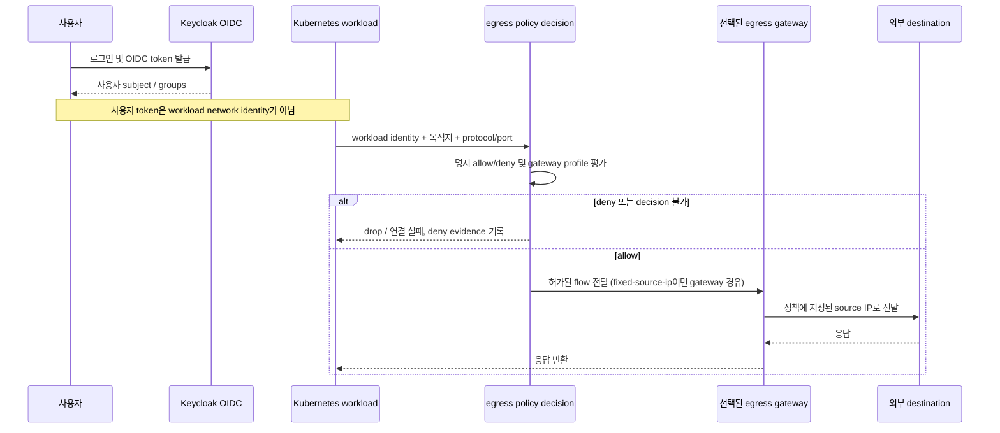

# External egress identity → policy → gateway 요청 흐름

이 문서는 #101의 identity-to-policy-to-gateway slice를 정의한다. 기존 Keycloak OIDC는 사용자 대 플랫폼 인증이며, workload의 외부 연결에 대한 egress identity 또는 허가를 자동으로 제공하지 않는다. 또한 현행 APISIX 설정은 외부 사용자 ingress용이다. 따라서 아래 egress 연결은 **PROPOSED** 계약이며, 현재 구현 사실과 혼동하지 않는다.

## 1. 현행 경계와 설계 결정

- Keycloak realm `narwhal`은 `cluster-admin`, `developer`, `viewer`, `guest` 그룹을 발급한다. Portal은 `ALLOWED_GROUPS`의 bare group을 소비하고, Kubernetes API server는 별도 RBAC 평가에 `oidc:` 접두사를 붙인다 (`docs/common/oidc-rbac-contract.md`, `scripts/cluster/11-2-keycloak-config.sh`, `scripts/cluster/11-4-keycloak-apiserver.sh`).
- APISIX는 MetalLB `192.168.56.200`으로 들어오는 HTTP(S) ingress gateway다 (`docs/common/architecture.md`). `gitops/charts/narwhal-platform/templates/apisix-routes.yaml`에서 Gitea·Hubble 등 일부 route만 `openid-connect` plugin을 사용한다. Keycloak route는 IdP 자체를 upstream으로 제공하고, Portal route는 NextAuth가 OIDC를 처리한다. 즉 모든 APISIX route가 OIDC 정책 결정을 하는 것은 아니다.
- Cilium 설치는 `scripts/cluster/03-cni-install.sh`에서 `kubeProxyReplacement=true`를 설정한다. 저장소의 Cilium 설정 및 정책 검색 결과에서는 Cilium Egress Gateway 구성이나 workload egress allowlist 계약을 확인할 수 없다. `gitops/resources/network-policies.yaml` 주석은 기본 deny egress가 Cilium과 충돌해 재강화를 후속 작업으로 남겼다고 기록한다.
- **D1 — 신원 분리:** Keycloak 사용자 subject/group는 로그인 사용자 식별에만 쓴다. 외부 egress의 주체는 Kubernetes workload로 하고 namespace, workload selector, ServiceAccount를 식별 필드로 삼는다. 사용자 로그인만으로 workload egress를 허가하지 않는다.
- **D2 — 게이트웨이 분리:** 정책 결정은 workload egress policy 계층에서 하고, 고정 source IP 경로가 필요하면 호환성이 확인된 Cilium Egress Gateway 또는 별도 명시적 egress proxy가 집행한다. APISIX는 그 역할이 별도로 배치·구성되기 전까지 egress gateway로 간주하지 않는다.

## 2. 제안 정책 입력과 결정

정책은 다음 필드를 모두 명시한다. 아래는 **PROPOSED schema**이고 현재 CRD/API를 뜻하지 않는다.

| 필드 | 의미 / 검증 규칙 |
|---|---|
| `subject.namespace` | Kubernetes namespace. 비어 있으면 거부. |
| `subject.workloadSelector` | namespace 안의 workload/pod label selector. 빈 selector 또는 namespace 전체 선택은 명시적 승인 없이는 거부. |
| `subject.serviceAccount` | workload가 사용하는 ServiceAccount. label selector와 함께 평가해 이름 재사용·오분류를 줄인다. |
| `destination.cidr` | 외부 IPv4/IPv6 CIDR. FQDN 기반 정책과 별개로 기록한다. |
| `destination.fqdn` | 선택적 DNS 이름. 해석된 주소 집합과 갱신 시각을 감사 기록에 남긴다. DNS 이름 자체가 TLS hostname 검증을 대체하지 않는다. |
| `protocol`, `port` | 허용할 전송 프로토콜과 포트. 미지정은 deny. |
| `gateway.profile` | `disabled`, `direct`, `fixed-source-ip` 중 하나 (**PROPOSED enum**). 고정 IP 요구가 없는 경우 `direct`를 선택한다. |
| `gateway.expectedSourceIPs` | `fixed-source-ip`일 때 필수인 외부에서 관측될 source IP 목록. `direct`/`disabled`에서는 비워 둔다. |
| `decision` | `allow` 또는 `deny`. 정책이 없거나 매치가 모호하면 deny. |
| `owner`, `reason`, `expiresAt` | 변경 책임자, 업무 사유, 선택적 만료. 감사·만료 검토에 사용한다. |

평가 순서: (1) workload가 namespace/selector/ServiceAccount를 모두 만족하는지 확인, (2) 목적지·프로토콜·포트를 비교, (3) 명시 deny 우선, (4) 명시 allow만 허가, (5) 나머지는 deny. FQDN은 DNS 관측/갱신에서 실제 주소 집합이 결정되기 전까지 허가하지 않는다. 주소 변경, TTL 만료, resolver 오류 시 기존 허가를 무기한 확장하지 않고 해당 FQDN 규칙의 신규 연결을 차단한다.

## 3. 요청 흐름

Keycloak은 이 흐름에서 사람 사용자의 upstream 인증자일 뿐이다. OIDC token을 workload에 전달하거나, APISIX의 `X-Userinfo`/사용자 header를 source identity로 신뢰하지 않는다. 요청마다 정책 판단에는 workload의 Kubernetes identity와 목적지 속성이 필요하다. 정책 결정기와 gateway 간 배포 방식은 **PROPOSED**이며 현재 구현되어 있지 않다.

## 4. Hop 장애와 fail-closed 계약

| 장애 지점 | 요청 처리 | 복구 / 기존 연결 |
|---|---|---|
| Keycloak discovery/token 발급 불가 | 새 사용자 로그인 및 OIDC token 갱신 실패. 이미 검증된 유효 token은 소비자의 기존 만료 규칙까지 사용할 수 있으나, 만료·검증 실패 token은 거부한다. | workload egress의 런타임 허가에 Keycloak 가용성을 동기 의존성으로 두지 않는다. 사용자·그룹 변경의 즉시 반영은 보장하지 않는다 (`docs/common/oidc-rbac-contract.md` §5). |
| workload identity 판별 불가 또는 정책 결정기 오류/timeout | 새 flow deny/drop. 캐시된 allow는 만료 전까지도 사용할 수 없도록 하는 것을 기본으로 한다 (**PROPOSED fail-closed**). | decision health 회복 후 재평가. 기존 connection은 구현별로 지속될 수 있으므로 gateway/policy 변경 시 세션 종료 동작을 별도 검증한다. |
| policy sync 지연 또는 설정 버전 불일치 | 새/변경 workload는 allow가 동기화됐다는 확인 전 deny. 오래된 allow 정책은 만료/epoch 불일치 시 거부. | 동기화 완료 후 새 flow에서 적용. pod 시작 시점의 enforcement gap을 runtime에서 측정해야 한다. |
| egress gateway node/경로 장애 | `fixed-source-ip` 규칙은 다른 source IP로 우회시키지 않고 deny/drop. | 대체 gateway가 동일하게 승인된 source IP를 제공한다고 검증된 경우에만 자동 failover 허용. 그렇지 않으면 중단을 택한다. 연결 재설정 가능. |
| external destination/firewall 장애 | 연결 실패. gateway는 목적지를 재작성하거나 넓은 allowlist로 우회하지 않는다. | destination과 expected source IP를 가진 재시도만 허용하며 실패를 관측 가능하게 한다. |
| APISIX 장애 | APISIX를 사용하는 ingress route만 영향 받는다. workload egress는 명시적으로 APISIX proxy를 경유하도록 설계된 경우에만 영향 받는다. | APISIX 장애를 Cilium egress policy 우회 사유로 삼지 않는다. 현행 APISIX ingress 기능과 egress 기능은 별도다. |

“failover 성공”은 연결이 살아남는다는 뜻만이 아니다. 정책과 허용 destination이 유지되고, 고정 IP를 선언한 경우 외부 관측 source IP가 `expectedSourceIPs` 안에 있어야 한다. 이 조건을 증명하지 못한 대체 경로는 failover 성공으로 기록하지 않는다.

## 5. 요청별 evidence 최소 항목

정책 결정 및 gateway 관측은 #42 감사 모델 연계를 목표로 한다 (**PROPOSED; 현행 event schema 확인 불가**). 연결마다 가능한 범위에서 다음 필드를 상관키로 남긴다.

`timestamp`, `flow/correlation ID`, `namespace`, `pod/workload`, `serviceAccount`, `destination IP` 및 원래 `fqdn`(해당 시), `protocol`, `port`, `decision`, `policy reference/version`, `gateway node/profile`, 관측 `source IP`, `bytes in/out`, 종료/deny 사유.

사용자의 Keycloak `sub`/group를 workload flow에 자동 결합하지 않는다. 사용자 initiated workload 작업과 연결하는 상관키가 실제로 존재할 때만 별도 actor field로 기록하며, 값이 없으면 익명/미연결 상태로 남긴다. token, client secret, cookie, Authorization header는 기록하지 않는다.

## 6. 범위와 확인 가능한 한계

이 문서는 #101 중 identity → policy → gateway flow 및 각 hop의 실패 의미만 다룬다. Cilium Egress Gateway HA 구현, cloud/on-prem/bare-metal capability matrix, Cluster Mesh 및 datapath 호환성, source IP 고정의 실제 검증, gateway topology UI, offline egress 증거 수집, 메트릭/이벤트 schema는 구현·검증하지 않는다. 이 저장소의 `kubeProxyReplacement=true` 외 조합이 Egress Gateway와 호환되는지 추론하지 않으며 upstream/환경별 호환성 검증을 선행 조건으로 둔다.
